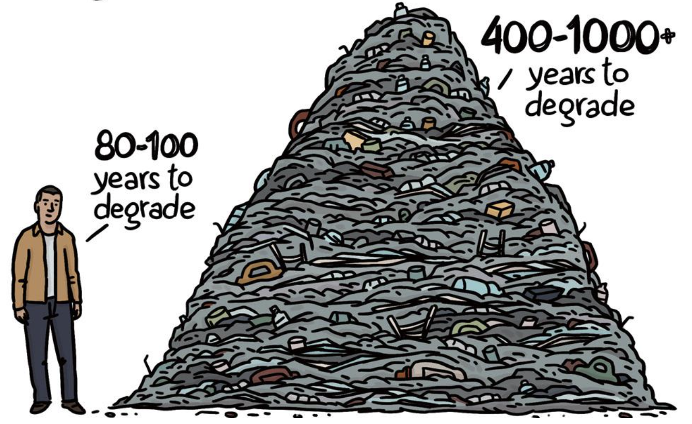

# Data Comcis

Data comics are a way of effectively communicating with data through data visualizations. They are inspired by the visual language of comics. This page lists examples we found online and those created during our research. We hope this website and our examples support a wider discussion and inspire journalists, artists, data scientists, and others to create their own data comics and help exploring and discovering this novel medium.

If you find or create your own data comics, get in touch with us. If you want to know more about research, see our publications.

# Gallery

<table>
	<tr>
	<td>
		
		

	</td>
	<td>
		
		## [Humans have made 8.3bn tons of plastic since 1950. This is the illustrated story of where it's gone](https://www.theguardian.com/us-news/2019/jun/23/all-the-plastic-ever-made-study-comic) 
Published by The Guardian

	</td>
	</tr>
	<tr>
	<td width="200px">
		
	</td>
	<td>
		## [Humans have made 8.3bn tons of plastic since 1950. This is the illustrated story of where it's gone](https://www.theguardian.com/us-news/2019/jun/23/all-the-plastic-ever-made-study-comic) 
Published by The Guardian
	</td>
	</tr>
	<tr>
	<td>
		
	</td>
	<td>
		<h2><a href="https://www.theguardian.com/us-news/2019/jun/23/all-the-plastic-ever-made-study-comic">Humans have made 8.3bn tons of plastic since 1950. This is the illustrated story of where it's gone</a></h2> 
		
Published by The Guardian

	</td>
	</tr>
</table>

## [Humans have made 8.3bn tons of plastic since 1950. This is the illustrated story of where it's gone](https://www.theguardian.com/us-news/2019/jun/23/all-the-plastic-ever-made-study-comic) 
Published by The Guardian

## [The Political Future is Female](https://thenib.com/the-political-future-is-female)
by [Stats](https://thenib.com/author/stats-x), published by [The Nib](https://thenib.com/)

##[Ireland Just Legalized Abortion. What About the Rest of the World](https://thenib.com/ireland-just-legalized-abortion-what-about-the-rest-of-the-world/?t=recent)
by [Stats](https://thenib.com/author/stats-x), published by [The Nib](https://thenib.com/)

## [Isotype Comics](isotype.html)
by Gerd Arntz and Otto Neurath

## [Smoking](smoking.html)
by Terri Po

## [Drawing the Poverty Line](poverty.html) 
by Lovisa Sundin

## [Mass Exinctions](massextinctions.html)
by Heidi Tamminen

## [Upper Middle Working](uppermiddle.html)
by Geraldine Sawyert

## [Weekly Sleep](weeklysleep.html)
by Zezhong Wang

## [CO2-Footprint](co2footprint.html)
by Benjamin Bach

## [Alliances before World War I](ww1.html)
by Benjamin Bach

## [Data Comics: Sequential Art for Data-Driven Storytelling](a7a70a9cc3dfdaec99f0c240a04830191827)
by Zhenpeng Zhao, Rachael Marr, and Niklas Elmqvist, 2015

## [Coton Brut](cotonbrut.html)
by Joseph Minard, around 1880
